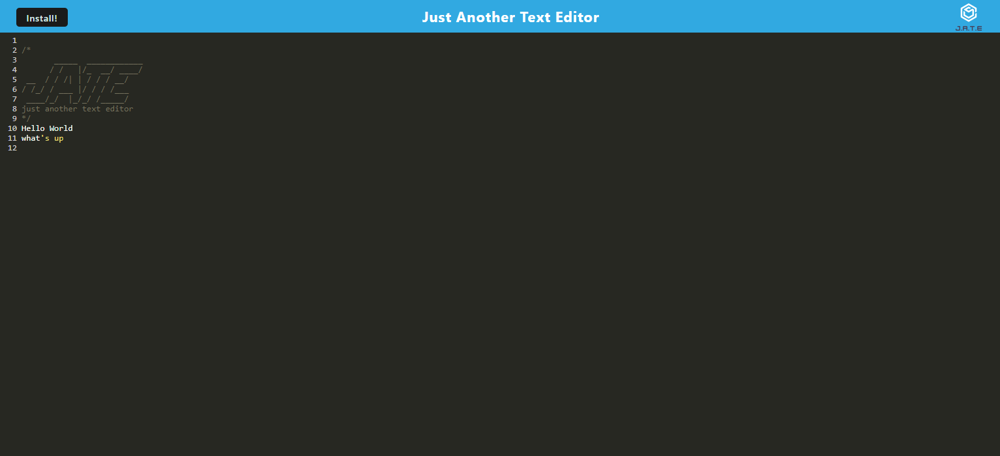

# PWA Text Editor

## Description

A single page PWA text editor that features IndexedDB and a number of data persistence techniques that serve as redundancy in case one of the options is not supported by the browser. The application will also function offline and can be installed on the user's computer.

## Usage

To use this application, navigate to the URL using the link below. Enter any text you like and click away from the input area to save the data. You can also click on the install button at the top left of the page to install this application onto your computer!

[Link to PWA Text Editor](https://serene-harbor-63930-14b8ac537d83.herokuapp.com/)

Screenshot of the application:

## Credits

Special thanks to Leif Hetland and Fred Kamm, our class instructors, for teaching and support for this material and also oft needed morale boosting. I referenced code guidance from the class repository to assist with this project.

In completing this project, I utilized the below resources to assist:

https://www.npmjs.com/package/webpack-pwa-manifest  
https://javascript.info/indexeddb  
https://www.npmjs.com/package/webpack-pwa-manifest  
https://developer.chrome.com/docs/workbox/modules/workbox-strategies/  
https://developer.chrome.com/docs/workbox/  
https://www.npmjs.com/package/html-webpack-plugin  

## License

This project is covered under the MIT License.

## Badges

## Questions

Please visit my [GitHub profile](https://github.com/kevinsmithseven/) or email me at [kevinsmithseven@gmail.com](mailto:kevinsmithseven@gmail.com) with any questions.

